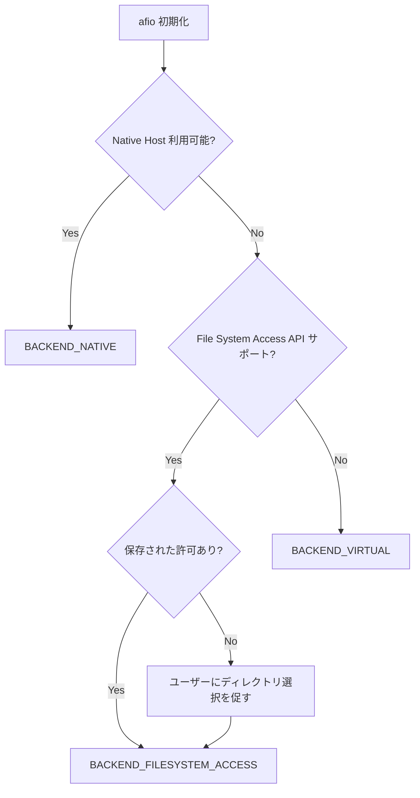

# File System Access API サポート

## 概要

iMacros MV3 は、ネイティブモジュールがインストールされていない環境でも、**File System Access API** を使用して実際のローカルファイルシステムにアクセスできるようになりました。

## 機能

### フォールバック優先順位

ファイルシステムアクセスは、以下の優先順位で自動的に選択されます:

1. **Native Messaging Host** (最優先)
   - `com.ipswitch.imacros.fio` ネイティブホスト
   - インストール済みの場合に使用
   - すべての機能をサポート

2. **File System Access API** (次点)
   - Chrome 86+ で利用可能
   - ユーザーが選択したディレクトリへのアクセス
   - ほぼすべてのファイル操作をサポート

3. **Virtual File System** (フォールバック)
   - chrome.storage.local / localStorage を使用
   - 最大 8MB のストレージ
   - オフラインでも動作

### File System Access API の特徴

**✅ サポートされる機能:**
- ファイルの読み書き
- ディレクトリの作成
- ファイル/ディレクトリの削除
- ファイル/ディレクトリの移動・リネーム
- ディレクトリ内のファイル一覧取得
- 画像ファイルの保存
- テキストファイルへの追記

**❌ 制限事項:**
- ユーザーが明示的にディレクトリを選択する必要がある
- ドライブ列挙はサポートされない(選択されたディレクトリのみ)
- Chrome 86+ (Chromiumベース) が必要
- セキュリティ上、ユーザーの許可が必要

## 使い方

### 初回セットアップ

1. iMacros パネルを開く
2. ネイティブモジュールがインストールされていない場合、ディレクトリ選択画面が表示される
3. **"Select Local Directory"** ボタンをクリック
4. マクロやファイルを保存したいディレクトリを選択
5. ブラウザが許可を要求 → **"許可"** をクリック

### ディレクトリの変更

ルートディレクトリを変更したい場合:

```javascript
// バックグラウンドページまたはコンソールで実行
await afio.resetFileSystemAccess();
await afio.promptForFileSystemAccess();
```

### 現在のバックエンドを確認

```javascript
// バックグラウンドページまたはコンソールで実行
console.log(afio.getBackendType());
// 出力: 'native' | 'filesystem-access' | 'virtual'
```

### API の使用例

File System Access API が有効な場合、通常の `afio` API がそのまま使えます:

```javascript
// ファイルを開く
const file = afio.openNode('/myfile.txt');

// テキストファイルを読み込む
const content = await afio.readTextFile(file);

// テキストファイルに書き込む
await afio.writeTextFile(file, 'Hello, World!');

// ディレクトリを作成
const dir = afio.openNode('/mydir');
await afio.makeDirectory(dir);

// ディレクトリ内のファイル一覧
const files = await afio.getNodesInDir(dir);
```

## 技術詳細

### アーキテクチャ

```
AsyncFileIO.js
├── callNative()           (Native Messaging Host)
├── callFsAccess()         (File System Access API) ← 新規追加
└── callFallback()         (Virtual File System)
```

### バックエンド検出フロー



### パーミッション管理

File System Access API で選択したディレクトリハンドルは、IndexedDB に永続化されます。これにより、次回起動時に再度ディレクトリを選択する必要がなくなります。

**IndexedDB スキーマ:**
- Database: `iMacrosFileSystemAccess`
- Object Store: `directoryHandles`
- Key: `rootDirectory`
- Value: `FileSystemDirectoryHandle`

### セキュリティ

- ユーザーが明示的に選択したディレクトリのみにアクセス可能
- ブラウザが自動的に許可を管理
- ページをリロードしても許可は維持される
- ユーザーはいつでもブラウザ設定から許可を取り消し可能

## ブラウザサポート

| ブラウザ | バージョン | サポート |
|---------|----------|---------|
| Chrome | 86+ | ✅ |
| Edge | 86+ | ✅ |
| Firefox | - | ❌ (未実装) |
| Safari | - | ❌ (未実装) |

## トラブルシューティング

### ディレクトリ選択ボタンが表示されない

- ブラウザが File System Access API をサポートしているか確認
- Chrome 86 以上を使用しているか確認
- コンソールでエラーを確認: `afio.isFileSystemAccessSupported()`

### 許可が失われた

ブラウザの設定で許可が取り消された場合:

```javascript
await afio.promptForFileSystemAccess();
```

で再度ディレクトリを選択できます。

### 仮想ファイルシステムにフォールバックしてしまう

以下の条件で仮想ファイルシステムにフォールバックします:

1. File System Access API がサポートされていない
2. ユーザーがディレクトリ選択をキャンセルした
3. File System Access API でエラーが発生した

## API リファレンス

### 新規追加メソッド

#### `afio.promptForFileSystemAccess()`

ユーザーにディレクトリ選択ダイアログを表示し、File System Access API を有効化します。

```javascript
const success = await afio.promptForFileSystemAccess();
if (success) {
    console.log('Directory selected successfully');
} else {
    console.log('User cancelled directory selection');
}
```

**戻り値:** `Promise<boolean>` - 成功した場合 `true`、キャンセルされた場合 `false`

#### `afio.resetFileSystemAccess()`

File System Access API の設定をリセットし、保存された許可を削除します。

```javascript
await afio.resetFileSystemAccess();
// バックエンドは BACKEND_UNKNOWN にリセットされ、次回アクセス時に再検出
```

**戻り値:** `Promise<void>`

#### `afio.isFileSystemAccessSupported()`

ブラウザが File System Access API をサポートしているかチェックします。

```javascript
const supported = afio.isFileSystemAccessSupported();
console.log('File System Access API supported:', supported);
```

**戻り値:** `boolean`

### 既存メソッドの動作変更

すべての既存の `afio` メソッドは、File System Access API バックエンドでも正常に動作します。

## 開発者向け情報

### FileSystemAccessService クラス

新しく追加された `FileSystemAccessService` クラスは、File System Access API を抽象化し、`VirtualFileService` と互換性のあるインターフェースを提供します。

**主要メソッド:**
- `init()` - サービスを初期化
- `promptForDirectory()` - ディレクトリ選択ダイアログを表示
- `node_exists(path)` - ノードの存在確認
- `node_isDir(path)` - ディレクトリかどうか確認
- `readTextFile(path)` - テキストファイルを読み込み
- `writeTextFile(path, data)` - テキストファイルに書き込み
- `appendTextFile(path, data)` - テキストファイルに追記
- `makeDirectory(path)` - ディレクトリを作成
- `remove(path)` - ファイル/ディレクトリを削除
- `moveTo(src, dest)` - ファイル/ディレクトリを移動
- `getNodesInDir(path, filter)` - ディレクトリ内のノード一覧取得

### イベント

`FileSystemAccessService` は以下のイベントを発火します:

```javascript
const fsAccess = new FileSystemAccessService();

fsAccess.on('ready', (data) => {
    console.log('FileSystemAccessService is ready', data);
});

fsAccess.on('change', (event) => {
    console.log('File system changed', event);
});
```

**イベントタイプ:**
- `ready` - サービスが初期化された
- `change` - ファイルシステムに変更があった
  - `type`: `'fileWritten'`, `'directoryCreated'`, `'nodeRemoved'`, `'nodeMoved'`, `'rootChanged'`, `'rootReset'`

## まとめ

File System Access API の統合により、ネイティブモジュールなしでも実際のローカルファイルシステムにアクセスできるようになりました。これにより、iMacros MV3 はより多くの環境で使用可能になります。

従来の仮想ファイルシステムの 8MB 制限から解放され、ディスク容量が許す限り大きなファイルを扱えるようになります。
