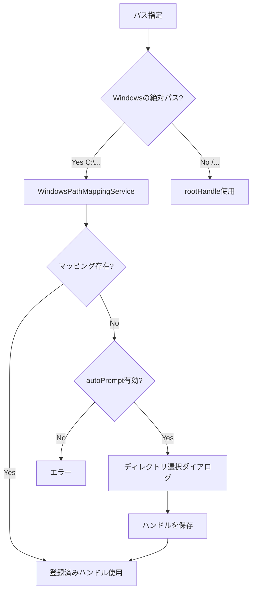

# Windowsパスマッピング機能

## 概要

iMacros MV3は、File System Access APIを使用してWindowsの実際のパス（C:\Users\...など）にアクセスできるようになりました。

この機能により、ネイティブモジュールがインストールされていない環境でも、Windowsの実パスを使用してファイルやディレクトリにアクセスできます。

## 背景

従来、iMacros MV3では以下の3つのファイルシステムバックエンドがありました：

1. **Native Messaging Host** - ネイティブモジュール経由でのアクセス（最優先）
2. **File System Access API** - 仮想パス（`/`で始まる）のみサポート
3. **Virtual File System** - Chrome storage/localStorageを使用（フォールバック）

問題点：
- Windowsの実パス（C:\Users\...）はNative Messaging Hostでしかアクセスできない
- ネイティブモジュールがない環境では、実パスを使用しようとするとエラーになる

## 解決策

**WindowsPathMappingService**を実装し、以下の機能を提供：

1. Windowsの実パスを検出
2. ユーザーにディレクトリ選択を促す
3. 選択されたディレクトリハンドルをIndexedDBに永続化
4. パスに応じて適切なディレクトリハンドルを使用

## 仕組み

### パスマッピング

Windowsの実パス（例: `C:\Users\John\Documents\iMacros`）が指定されたとき：

1. WindowsPathMappingServiceがパスを検出
2. 既にマッピングが登録されているかチェック
3. 登録されていない場合、ユーザーにディレクトリ選択ダイアログを表示
4. 選択されたディレクトリハンドルを保存
5. 次回以降、同じパスまたはそのサブディレクトリへのアクセスに同じハンドルを使用

### 親パスの自動解決

親パスがマッピングされている場合、そのサブパスも自動的に解決されます。

例：
- `C:\Users\John\Documents` がマッピングされている
- `C:\Users\John\Documents\iMacros\test.iim` にアクセスしたい
- → 自動的に親パスのマッピングを使用して `iMacros/test.iim` にアクセス

## 使い方

### 基本的な使い方

```javascript
// Windowsパスを開く
const file = afio.openNode('C:\\Users\\John\\Documents\\test.txt');

// ファイルを読み込む（初回は自動的にディレクトリ選択ダイアログが表示される）
const content = await afio.readTextFile(file);

// ファイルに書き込む
await afio.writeTextFile(file, 'Hello, World!');
```

### 明示的にパスをマッピング

```javascript
// ユーザーにディレクトリ選択を促す
// File System Access APIが初期化されていない場合、自動的に初期化されます
await afio.addWindowsPathMapping('C:\\Users\\John\\Documents');
```

**注意**: `addWindowsPathMapping()` は、File System Access APIが初期化されていない場合、自動的に初期化を試みます。初回呼び出し時は、ブラウザがディレクトリ選択ダイアログを表示します。

### マッピングを管理

```javascript
// すべてのマッピングを取得
const mappings = afio.getAllWindowsPathMappings();
console.log('Registered mappings:', mappings);
// 出力例:
// [
//   {
//     originalPath: 'C:\\Users\\John\\Documents',
//     normalizedPath: 'c:/users/john/documents',
//     timestamp: 1234567890123
//   }
// ]

// 特定のマッピングを削除
await afio.removeWindowsPathMapping('C:\\Users\\John\\Documents');

// すべてのマッピングをクリア
await afio.clearAllWindowsPathMappings();
```

### サポート状況を確認

```javascript
// File System Access APIがサポートされているか
const fsaSupported = afio.isFileSystemAccessSupported();

// Windowsパスマッピングがサポートされているか
const wpmSupported = afio.isWindowsPathMappingSupported();

console.log('File System Access API:', fsaSupported);
console.log('Windows Path Mapping:', wpmSupported);
```

## マクロでの使用例

### 例1: Windowsパスを使用してファイルを読み込む

```
VERSION BUILD=9.0.3 RECORDER=CR
SET !DATASOURCE C:\Users\John\Documents\data.csv
SET !DATASOURCE_COLUMNS 3
SET !DATASOURCE_LINE {{!LOOP}}
SET !LOOP 1
ADD !EXTRACT {{!COL1}}
ADD !EXTRACT {{!COL2}}
ADD !EXTRACT {{!COL3}}
```

初回実行時、iMacrosは自動的にディレクトリ選択ダイアログを表示します。
`C:\Users\John\Documents`を選択すると、次回以降は自動的にそのディレクトリを使用します。

### 例2: Windowsパスを使用してログを保存

```
VERSION BUILD=9.0.3 RECORDER=CR
SET !EXTRACT_TEST_POPUP NO
TAG POS=1 TYPE=H1 ATTR=TXT:* EXTRACT=TXT
SAVEAS TYPE=EXTRACT FOLDER=C:\Users\John\Logs FILE=log_{{!NOW:yyyymmdd}}.txt
```

## エラーメッセージ

### パスマッピングが見つからない場合

```
Error: No File System Access mapping found for path: C:\Users\John\Documents\test.txt
Please select the directory using promptForPath() or enable Native File Access.
```

**解決方法**：
1. ディレクトリを選択: `await afio.addWindowsPathMapping('C:\\Users\\John\\Documents')`
2. またはネイティブモジュールをインストール

### Windowsパスマッピングが無効な場合

```
Error: Windows absolute path detected: C:\Users\John\Documents\test.txt
Windows path mapping is not enabled.
Please enable it by setting enableWindowsPathMapping: true in options,
or use Native File Access.
```

**解決方法**：
FileSystemAccessServiceの初期化時に`enableWindowsPathMapping: true`を設定してください。
（デフォルトで有効になっています）

## 技術詳細

### アーキテクチャ

```
AsyncFileIO.js
├── callNative()                    (Native Messaging Host)
├── callFsAccess()                  (File System Access API)
│   └── FileSystemAccessService
│       └── WindowsPathMappingService
└── callFallback()                  (Virtual File System)
```

### パス解決フロー



### IndexedDB構造

**Database**: `iMacrosPathMapping`

**Object Store**: `pathMappings`

**キー**: 正規化されたパス（小文字、スラッシュ統一）

例: `c:/users/john/documents`

**値**:
```javascript
{
  originalPath: 'C:\\Users\\John\\Documents',
  normalizedPath: 'c:/users/john/documents',
  handle: FileSystemDirectoryHandle,
  timestamp: 1234567890123
}
```

### パス正規化

Windowsパスは大文字小文字を区別しないため、以下のように正規化されます：

- バックスラッシュをスラッシュに変換: `C:\Users` → `C:/Users`
- 小文字に変換: `C:/Users` → `c:/users`
- 末尾のスラッシュを削除: `c:/users/` → `c:/users`

### パーミッション管理

File System Access APIの永続的なパーミッション機能を使用：

1. ユーザーがディレクトリを選択
2. ディレクトリハンドルをIndexedDBに保存
3. 次回起動時、保存されたハンドルの許可を確認
4. 許可が維持されている場合、そのまま使用
5. 許可が失われている場合、再度ユーザーに許可を要求

## 制限事項

1. **Chrome 86+が必要** - File System Access APIを使用するため
2. **ユーザーの許可が必要** - ディレクトリにアクセスするには、ユーザーが明示的に選択する必要がある
3. **ドライブ列挙は不可** - File System Access APIでは任意のドライブを列挙できない
4. **セキュリティ制限** - ブラウザが許可しないディレクトリ（システムディレクトリなど）にはアクセスできない

## ブラウザサポート

| ブラウザ | バージョン | サポート |
|---------|----------|---------|
| Chrome | 86+ | ✅ |
| Edge | 86+ | ✅ |
| Firefox | - | ❌ (File System Access API未実装) |
| Safari | - | ❌ (File System Access API未実装) |

## トラブルシューティング

### 「Permission denied」エラー

**原因**: ブラウザがディレクトリへのアクセス許可を取り消した

**解決方法**:
```javascript
// パーミッションを再要求
await afio.removeWindowsPathMapping('C:\\Users\\John\\Documents');
await afio.addWindowsPathMapping('C:\\Users\\John\\Documents');
```

### マッピングが機能しない

**確認事項**:
1. Chrome 86以上を使用しているか: `chrome://version`で確認
2. File System Access APIがサポートされているか: `afio.isFileSystemAccessSupported()`
3. WindowsPathMappingServiceが読み込まれているか: `afio.isWindowsPathMappingSupported()`
4. パスが正しく指定されているか: `C:\Users\...`の形式

### マッピングがリセットされる

**原因**: ブラウザのキャッシュやIndexedDBがクリアされた

**解決方法**: 再度ディレクトリを選択してください

## まとめ

WindowsPathMappingServiceにより、ネイティブモジュールなしでもWindowsの実パスを使用できるようになりました。

**利点**:
- ネイティブモジュール不要
- 永続的なパーミッション
- 既存のマクロとの互換性
- 明確なエラーメッセージ

**使用推奨順序**:
1. Native Messaging Host（利用可能な場合）
2. Windowsパスマッピング（File System Access API）
3. 仮想ファイルシステム（フォールバック）
